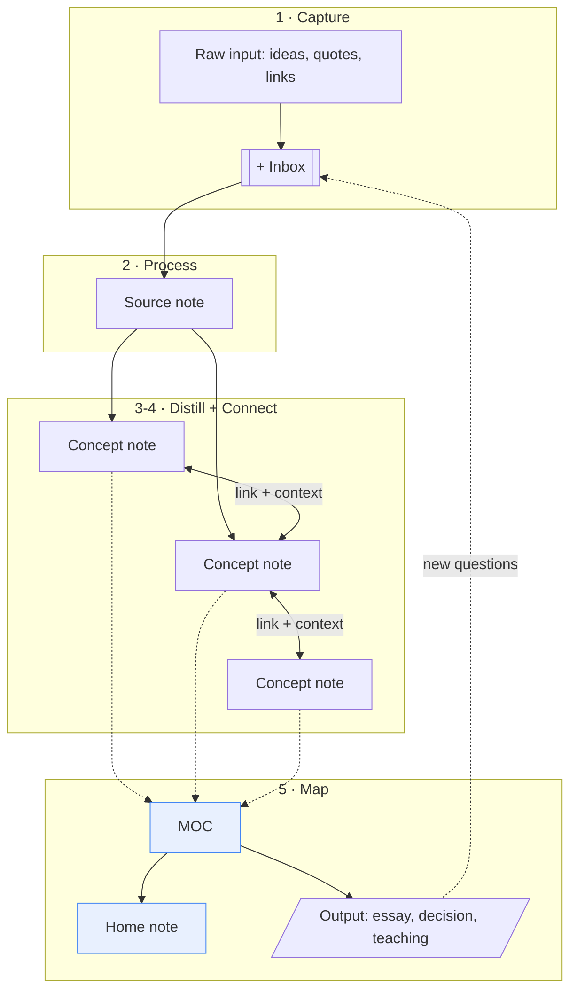

Part of the IMF Framework spec: [[00 Overview]] · [[01 Principles & Concepts]] · [[02 Implementation]] · [[03 Templates]] · **04 Reference**

# IMF Framework — Reference

## Data model

What becomes a separate note vs. a property, link, or bullet:

|Element|Separate note?|Represented as|
|---|---|---|
|**Source**|Yes|Source note (`type: source`)|
|**Concept**|Yes|Concept note (`type: concept`)|
|**MOC**|Yes|MOC note (`type: moc`)|
|**Project**|Optional|Project note (`type: project`)|
|**Idea**|No|A concept note once it matures; otherwise a line in an MOC or inbox note|
|**Question**|No|A bullet under "Open questions" in the relevant note or MOC|
|**Insight**|No|A concept note once it matures, or link context ("X explains Y")|
|**Relationship**|No|An `[[internal link]]` with context|
|**Reference**|No|A property (`url`, `author`) on a source note|

Four things are notes: Concept, Source, MOC, Home (Project optional). Everything else is content, a property, or a link.

## Worked example

Topic: "How do people actually learn and retain information?"

**Capture.** While reading, three fleeting notes go into `+ Inbox`: "spacing effect," "testing beats rereading," "write in your own words."

**Process.** `Sources/@ahrens2017-smart-notes.md`:

```markdown
---
type: source
author: Sönke Ahrens
title: How to Take Smart Notes
year: 2017
status: Done
---
# How to Take Smart Notes
## Summary (in my own words)
Writing notes in your own words forces active recall and understanding.
## Notes → concepts to extract
- [x] [[Active recall]]
- [x] [[Atomic note]]
```

**Distill.** `Atlas/Active recall.md`:

```markdown
---
type: concept
up: "[[Learning MOC]]"
---
# Active recall
> Retrieving information from memory strengthens it more than re-reading.

## Connections
- Mechanism behind [[Writing in your own words]]
- Amplified by [[Spacing effect]]
```

And `Atlas/Spacing effect.md`:

```markdown
---
type: concept
up: "[[Learning MOC]]"
---
# Spacing effect
> Distributing study over time beats massing it.

## Connections
- Combines with [[Active recall]] (spaced retrieval)
```

**Connect.** Each note links to related notes with a short reason attached ("mechanism behind…", "amplified by…"). Backlinks now show `Active recall` referenced from both `Spacing effect` and the Ahrens source note.

**Map.** Six-plus notes now cluster on learning → `Atlas/Learning MOC.md`:

```markdown
---
type: moc
tags: [moc]
---
# Learning MOC
> How understanding is built and retained.

## How memory strengthens
- [[Active recall]]
- [[Spacing effect]]

## How to make notes that learn
- [[Atomic note]]
- [[Writing in your own words]]

## Open questions
- How does concept mapping compare to MOCs for retention?
```

`[[Learning MOC]]` then gets added to the Home note under "Main Maps."

**Result:** three loose highlights became two linked concept notes and a navigable map — with provenance intact and a new open question surfaced along the way.

## Maintenance

A light weekly pass:

- Empty the inbox — turn every capture into a source or concept note, or delete it.
- Update 1–2 MOCs.
- Prune links and notes that don't hold up anymore.

## Watch out for

- Capturing without ever processing — the inbox becomes a second archive.
- Topical tags or tag hierarchies.
- Filing by topic in a folder instead of an MOC.
- An MOC per tag, or more than ~15 MOCs total.
- A separate note for every question, idea, or insight.
- One giant note type and no MOCs at all.
- Summarizing a note until it loses its point.
- Copying this whole system at once instead of growing into it.
- Writing notes and never linking them.

## Limitations

- **Needs upkeep.** Skip the weekly review for too long and the maps stop matching the notes.
- **More to learn than plain folders.** Properties, templates, and link discipline take some getting used to; the payoff shows up mainly once you're past a couple hundred notes.

## Framework diagram



Solid arrows = the flow from raw idea to output. Dashed arrows = curation into a map. Blue = the "fluid" layer (MOC + Home note).
